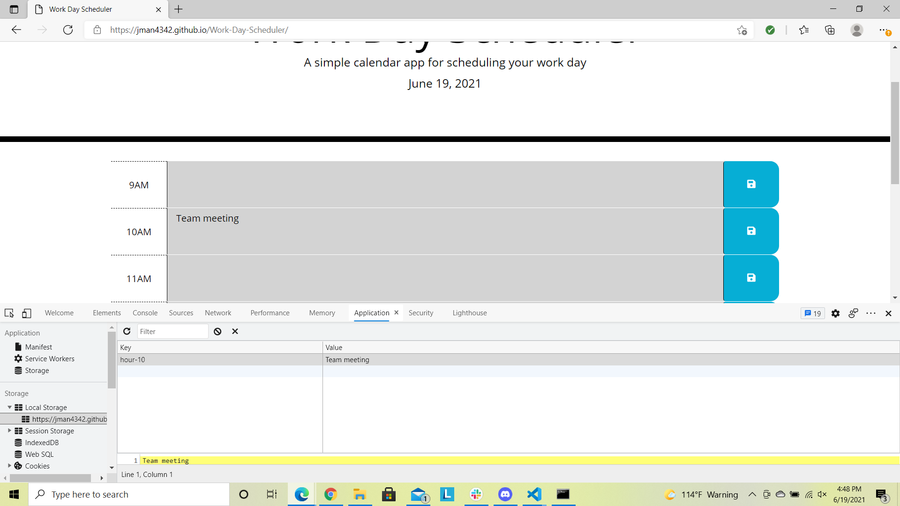
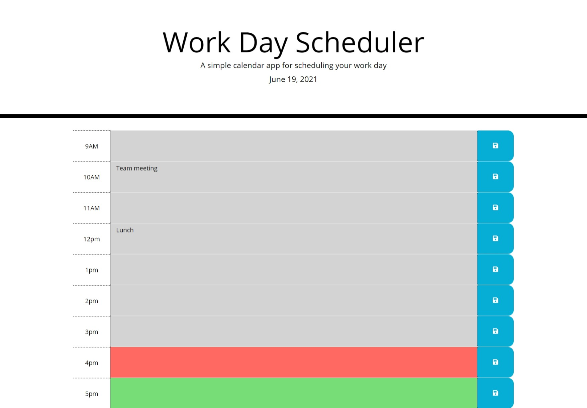

# Work-Day-Scheduler
---

## Description

In this assignment, I created a work day scheduler that will allow the user to plan out their work day. The current date will appear at the top of the screen for easy reference. The user will be able to enter their task or event into dedicated hour blocks, and save them utilizing local storage.  This will also allow the user to have their tasks reload onto the page if they were to close or refresh their window. 

As the day goes on, the scheduler will let the user know what hour they are in by highlighting the current hour in red.  Any hour in the past will be in grey indicating the time has past, and future hour blocks will be in green.

Some of the skills demonstrated during this assisgnemt include but not limited to:
* Utilizing jQuery to code the functionality of the page.
* Using the momentjs API to get the current date and time.
* Saving and retrieving task and events in local storage so that they can be loaded on page refresh.

---

## Image

Below are images of my completed work day scheduler page.

---

## Resources

I utilized the following sites to assist in creating my JavaScript quiz.
* https://momentjs.com
* https://api.jquery.com

---

## Application

You can find my work day scheduler page at the following:

* https://jman4342.github.io/Work-Day-Scheduler/